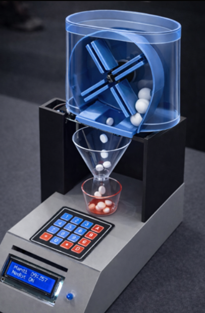
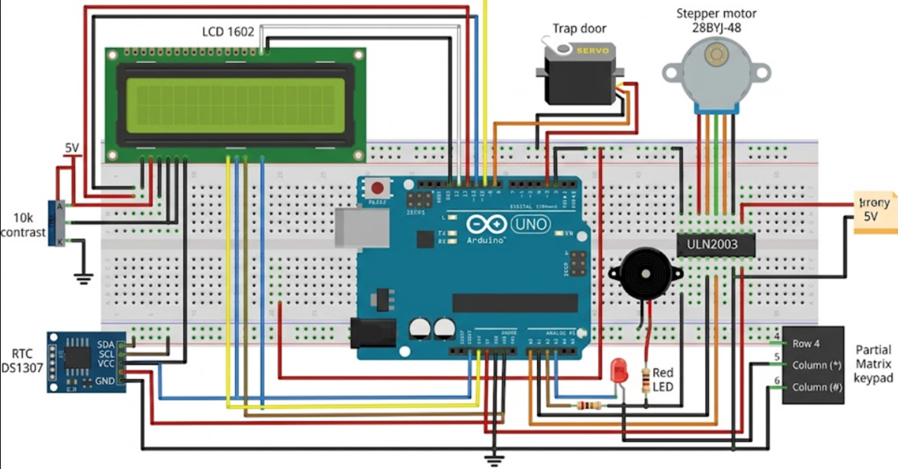

# MedBot | Smart Medication Companion

MedBot is an embedded smart medication assistance system designed to help users take their pills on time, reduce missed doses, and simplify daily medication management through reminders, alerts, and automatic dispensing.

<p align="center">
  
</p>

## Overview

Medication adherence can be difficult for many people, especially elderly users, busy individuals, or anyone managing multiple prescriptions. MedBot was developed as a compact embedded solution that reminds, guides, and assists the user during the medication process.

The system combines real time scheduling, progressive alerts, user confirmation, and automatic pill dispensing in a single Arduino-based prototype.

## Problem Statement

Many users face challenges such as:

- forgetting to take medication
- taking it at the wrong time
- missing proper follow-up
- struggling with daily routine management

These issues can reduce treatment effectiveness and increase health risks.

## Proposed Solution

MedBot addresses this problem by providing:

- scheduled medication reminders using a real time clock
- progressive alerts that become more noticeable over time
- automatic pill dispensing
- on-screen guidance through an LCD display
- user confirmation through a keypad
- a simple embedded system that works offline

## Demo

Watch the project demo here:

[MedBot Demo Video](https://youtube.com/shorts/HksG5nQMoSc?feature=share)

## Prototype

Below is the physical prototype of MedBot:

<p align="center">
  
</p>

## Circuit Design

Below is the hardware circuit design used for the system:

<p align="center">
  
</p>

## Key Features

- multiple reminders per day
- progressive alert escalation
- automatic pill release mechanism
- user confirmation through keypad input
- LCD feedback and status display
- full hardware and software integration
- standalone embedded operation without internet connection

## Technologies Used

### Hardware
- Arduino Uno R3
- RTC DS1307
- LCD 1602
- servo motor
- 28BYJ-48 stepper motor
- ULN2003 driver
- keypad
- buzzer
- LED

### Software
- Arduino IDE
- Embedded C++ with Arduino

## Hardware Architecture

| Component | Function |
|---|---|
| Arduino Uno R3 | Main controller |
| RTC DS1307 | Keeps track of real time |
| LCD 1602 | Displays time and system messages |
| Servo Motor | Controls the trap door |
| Stepper Motor + ULN2003 | Rotates the dispensing mechanism |
| Keypad | User input and confirmation |
| Buzzer | Audio alert |
| LED | Visual alert |

## Pin Configuration

| Component | Pins |
|---|---|
| LCD 1602 | 2, 12, 13, A0, A1, A2 |
| RTC DS1307 | A4 (SDA), A5 (SCL) |
| Servo Motor | 7 |
| Stepper Motor + ULN2003 | 8, 9, 10, 11 |
| Buzzer | 3 |
| LED | A3 |
| Keypad | 4, 5, 6 |

## System Workflow

1. The RTC module continuously tracks the current time.
2. When a scheduled medication time is reached, MedBot triggers an alert.
3. The buzzer and LED notify the user.
4. The LCD displays a message indicating that it is time to take the medication.
5. The servo opens the trap door.
6. Pills are dispensed into the container.
7. The user confirms the intake using the keypad.
8. The stepper motor prepares the next dose cycle.
9. The system resets and waits for the next programmed reminder.

## Why This Project Matters

MedBot is not just a dispensing mechanism. It is a user-centered embedded system designed to improve autonomy, safety, and medication adherence in a simple and accessible way.

Its main strengths are:

- a practical real world use case
- complete integration of electronics, programming, and mechanical design
- offline operation
- strong potential for future healthcare applications

## Innovation

What makes MedBot interesting is its ability to simulate intelligent assistance using embedded logic only. The system does not rely on cloud services or internet connectivity. Instead, it uses local scheduling, hardware control, and contextual feedback to create a reliable and self-contained user experience.

## Future Improvements

Possible next steps for the project include:

- voice interaction
- mobile application integration
- IoT connectivity
- health monitoring and usage analytics
- improved pill detection
- more secure dose verification
- multi-user support
- compact enclosure redesign

## Repository Structure

```bash
Starhack-2026/
├── medbot-prototype.png
├── medbot-circuit.png
├── README.md
└── Code_Starhack_2026_equipe2.ino

Project Status

This project is currently a functional prototype developed for academic and demonstration purposes.

Disclaimer

MedBot is a prototype and is not a certified medical device. It should not be used as a replacement for professional medical equipment or medical supervision.
